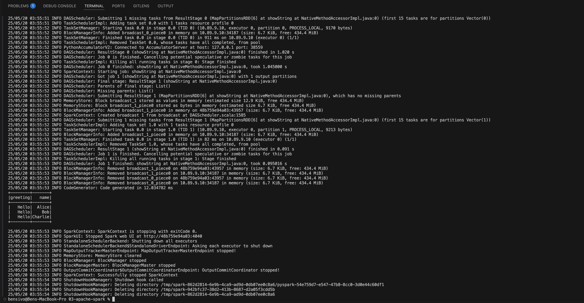
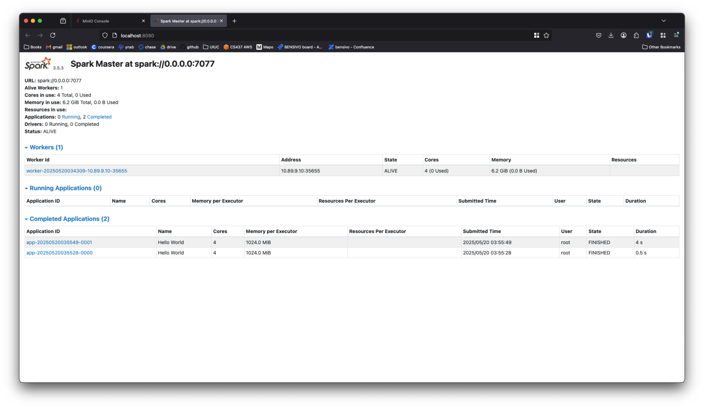

# 04 Apache Spark

## Introduction
The Trino Query engine is a great tool, it allows us to interact without Iceberg tables via a familiar SQL interface. However, in the world of big-data processing, we'll have 2 problems if we just use Trino:
- Loading - our data usually exists in some other format first, like CSV or Parquet, not Iceberg. We need to convert it into iceberg to query it with SQL.
- Transformation  - sql was designed for querying, but it's not that great at manipulating or transforming data. For that, a more procedural language would be better.


Apache Spark is the answer to these problems. It was designed for processing very large data-sets at scale, and is commonly used in data engineering, machine learning, and analytics. Using the Spark SDK, you can:
- Read data from a variety of data sources, including object-storage, databases, and even Kafka
- Transform the data using a robust dataframe API (or even SQL)
- Write datasets to downstream systems, like a data warehouse or lakehouse

Apache Spark supports a variety of languages, including Scala, Java, SQL, and Python. Most people getting started with Spark begin with the Python and SQL APIs, so what's what we'll use in this module.


Apache Spark uses a master-worker architecture. In a single spark cluster, there will be at least 1 "master" node, which exposes the Spark API and distributes jobs, plus multiple "worker" nodes, which receive jobs and execute them. It is important to remember this, because while writing Spark code, it may look like regular Java or Python, executing from top to bottom on a single machine. However, in reality, it's being compiled into a distributed task, distributed to many worker nodes, then being executed there in parallel. 

Managing Apache Spark Clusters at scale is not a simple task, but luckily most cloud providers offer fully-managed Spark Clusters as a service available to those without the time or expertise. In this module, we'll run a small local spark cluster using Docker.


## Running a local Spark Cluster
First, build the docker images for the Spark Master and Worker nodes. This command may take a while if you have a slower internet connection, the Spark docker images are large:
```
./build.sh
```

Then, run the cluster:
```
./spark.sh
```

The Spark cluster should be running in docker/podman, and you will be able to access a simple Spark UI at http://localhost:8081. There, you will see one worker node, and no running applications. 


## Submitting a job to the Spark Cluster
As is tradition, we'll start by submitting a simple "Hello, world!" job (`hello-world.py`) to the Spark Cluster. You can do this with the script below:
```
./submit.sh
```

If you look at the script contents, you'll see it's not as simple as just running the python file `python hello-world.py`. It runs an Apache Spark docker container and submits the python file to the master node at the url `spark://spark-master:7077`. 


```
# ...the important part of submit.sh

$CONTAINER_CMD run \
    --network lbe-spark-and-iceberg \
    -v $PWD:/app \
    -it \
    spark-base /opt/spark/bin/spark-submit --master spark://spark-master:7077 /app/hello-world.py
```

In the output, you'll see lots of logs related to the coordination logic between the spark master node and worker nodes. However, you'll also see a neatly-formatted table from our "print" statement, `df.show()`.



If you navigate back to the spark-master UI, you can see the "Hello World" job you just ran in the "Completed Applications" section.



In the next module, we'll write a basic EL (Extract, Load) spark job that reads our JSONL files from the 'Raw' bucket of MinIO, then writes them to the 'Bronze' bucket as a single Apache Iceberg table. Along the way we will discuss (and deploy) a Data Catalog. 


## Extract, Load, Transform 


## Note on libraries
Because jobs actually run on the Spark cluster, not in your machine, if you want to use any libraries (such as the Apache Iceberg library, or the AWS S3 / MinIO library), you have to install them on the cluster itself.

Look at the file `spark-base.dockerfile`, and you'll notice that we're pre-installing 2 libraries in the spark docker image - one for Icebeg, and one for S3 / MinIO. It's important when you're looking for libraries, that you find the right library versions that match the version of Java, Spark, and Scala that you have installed on your cluster.